# INTERIOR DESIGN - CI Project 1

**Interior Design** is an imagined company in Athlone, Ireland. This website was created for educational purposes as part of the Code Institute Diploma in Full-Stack Software Development. The project is for individuals seeking to enhance and transform their homes and for anyone interested in interior design.

[Live Preview Of Interior Design](https://sanitab17.github.io/interior-design/)

# Table of Contents

- [INTERIOR DESIGN - CI Project 1](#interior-design---ci-project-1)
- [Table of Contents](#table-of-contents)
- [UX](#ux)
  - [User](#user)
  - [User Goals](#user-goals)
  - [User Stories](#user-stories)
  - [Site owners Goals](#site-owners-goals)
    - [Requirements](#requirements)
    - [Expectations](#expectations)
  - [Design Choices](#design-choices)
    - [Fonts](#fonts)
    - [Icons](#icons)
    - [Colors](#colors)
    - [Structure](#structure)
- [Wireframes](#wireframes)
  - [Pages and Features](#pages-and-features)
    - [Header](#header)
    - [Footer](#footer)
    - [Home Page](#home-page)
    - [About Page](#about-page)
    - [Gallery Page](#gallery-page)
    - [Contact Page](#contact-page)
    - [Thank You Page](#thank-you-page)
    - [404 Page](#404-page)
    - [Features to be Implemented](#features-to-be-implemented)
- [Technology used](#technology-used)
- [Testing and Validation](#testing-and-validation)
  - [Bugs](#bugs)
- [Deployment](#deployment)
- [Credits](#credits)

# UX

## User

## User Goals

- Visually appealing.
- Effortless Exploration.
- Informative Content.

## User Stories

- As a user, I want to navigate the website using multiple devices and access social media.
- As a user, I want to find general information about Interior Design.
- As a user, I want to learn more about Interior Design's work.
- As a user, I want to be able to easily contact the website and see contact details.
- As a user, I want to apply for free consultation.

## Site owners Goals

- Attract more customers to Interior Design company.
- Inform customers about Interior Design's services.
- Inform customers about Interiors Design company.
- Show customers Interior Design's gallery as a portfolio.

### Requirements

- Easy to navigate on various screen sizes and search engines.
- Clear and precise information about Interior Design's company.
- Simple method of contacting the website.
- Visually appealing design maintained through all web pages.

### Expectations

- I expect all links to social media sites to be opened in a new tab.
- I expect all navigation links to work correctly.
- I expect screen size not to affect the quality of the website.
- I expect all information to be correct and accurate.

\
&nbsp;
[Back to Top](#table-of-contents)
\
&nbsp;

## Design Choices

### Fonts

In an effort to impart a sense of simplicity and a user-friendly aesthetic to the website, I have seamlessly integrated [Google Fonts](https://fonts.google.com/), [Hind Guntur](https://fonts.google.com/specimen/Hind+Guntur) and [Montserrat Alternate](https://fonts.google.com/?query=Montserrat+Alternates), with a sans-serif fallback. This approach is aimed at ensuring a user-friendly appearance.

### Icons

- I have opted to use open-source materials for icons, provided by [Font Awesome](https://fontawesome.com/icons).
- For the favicon, I used an icon from the [Canvas](https://www.canva.com/) and then converted it using [favicon.io](https://favicon.io/favicon-converter/).

### Colors

As for colors I decided to match them with hero images using [Image Color Picker](https://imagecolorpicker.com/).

Use of various colors will explain below.

- #fff1dc – Tis color will be used for header, to harmoniously match with hero images across the website.
- #698aab - This color will be used for active navigation bar underline, to provide clear user guidance throughout the website.
- rgb(250, 250, 250, 0.6) (transparency of #fafafa) - This color will be used for hero texts background.
- #384e6a - This color will be used for borders, shadows, color for submit button and background color as hover effect and footer background.
- rgb(56, 78, 106, 0.4) (transparency of #384e6a) - This color will be used for contact form background and thank you page text background, to maintain visually appealing look.
- #dedede - This color will be used for home page button hover effect, submit button color and as hover effect buttons background. Additionally, it will be used for the icons and text in the footer, ensuring harmonious design.
- #a8e265 - This color will be used for navigation bar as background color before transition, complementing the green plants in hero images for a visually pleasing experience.
- #cd7c0c - This color will be used for navigation bar as background color after transition.
- #000000 - This color will be used for text.
- #eff3f6 - This color will be used as the theme color, contributing to a light and neutral color palette throughout the website.

### Structure

My website development will follow a mobile-first strategy, as instructed in the Love Running Project, with a focus on smaller screens initially. I will commence styling for the Samsung Galaxy Fold, which has a width of 280px. To ensure responsiveness, I will rely on common standard media query breakpoints for responsive web design.

\
&nbsp;
[Back to Top](#table-of-contents)
\
&nbsp;

# Wireframes

For structuring the website layout and design, I have chosen [Figma](https://www.figma.com/). My aim is to create a user-friendly website that maintains its design consistency across all pages.

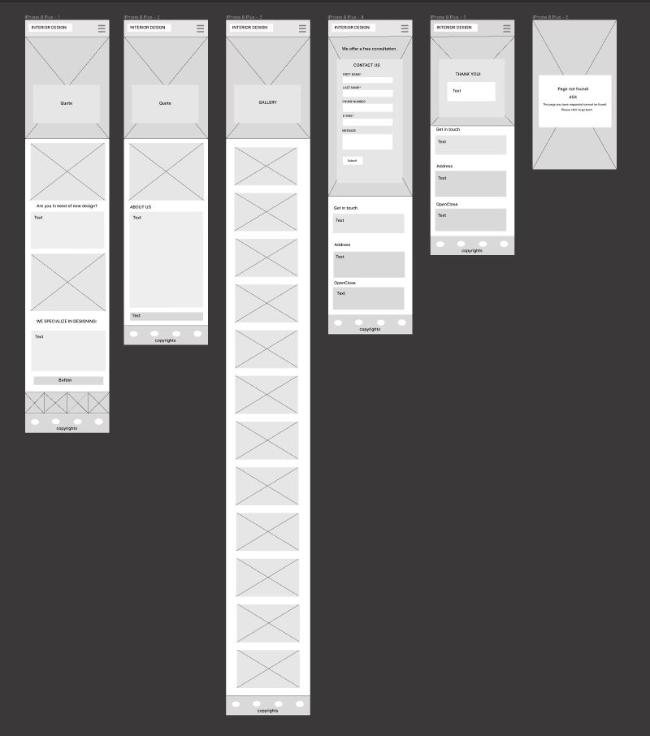

\
&nbsp;
[Back to Top](#table-of-contents)
\
&nbsp;

## Pages and Features

### Header

I designed the header in alignment with the Love Running Project, featuring the h1 logo on the left side and the navigation bar on right side.

For each menu item, I included an active page indicator, shown as a blue underline, to give a clear visual location on the site.

For the purpose of design enhancement, visual appeal, and optimal user experience on screens over 992px, I introduced a hover transform effect with an underline background color transition from #a8e265 to #cd7c0c. This selection harmonizes with the greenery in the hero images, contributing to a cohesive and engaging overall design.

For screen sizes below 768px, I substituted the standard menu with a hamburger icon to enhance compatibility with smaller screens and elevate user interaction.

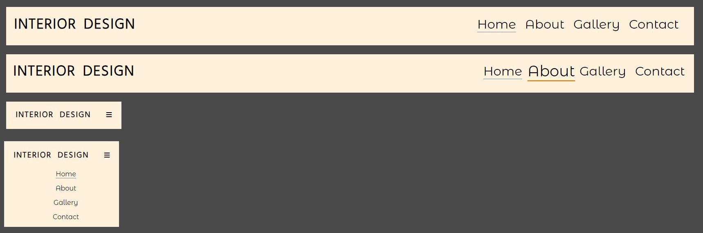

\
&nbsp;
[Back to Top](#table-of-contents)
\
&nbsp;

### Footer

In my design for the website's footer, I selected a blue color to complement the hero image, aiming to enhance the overall appeal of the webpages and create a harmonious visual experience for users.

In the footer section, users will discover links to social media as well as copyright text.

To align the footer with the header and provide a consistent aesthetic throughout the website, hover effects were implemented for screens over 992px.

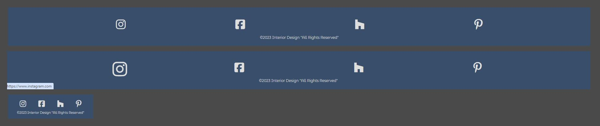

\
&nbsp;
[Back to Top](#table-of-contents)
\
&nbsp;

### Home Page

The homepage is structured into three sections. The hero section initiates with the quote: "Design is a plan for arranging elements in such a way as best to accomplish a particular purpose." These concise introductions offer visitors a brief overview, providing a fundamental understanding of Interior Design. The message is complemented by an illustrative background image that reflects the essence of Interior Design.

Desktop view

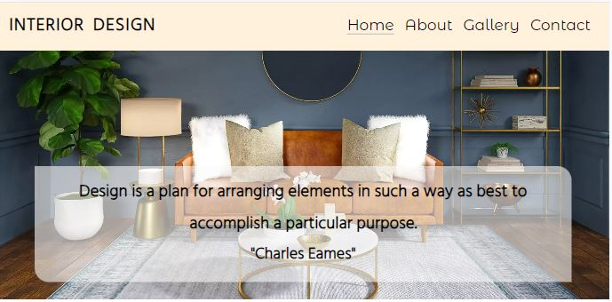

The second section features compelling content designed to inform visitors about the services offered in Interior Design. This engaging content is accompanied by two interior design pictures, enhancing the visual presentation of the information.

Desktop view

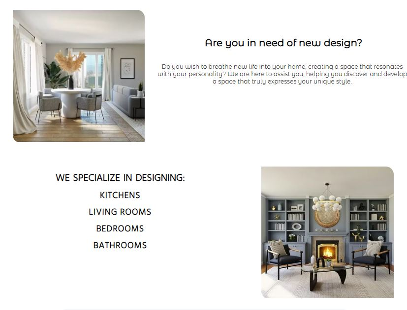

The third section comprises four images and a button leading to the gallery. This design allows visitors easy access to view Interior Design's works directly without the need to scroll back to the top of the page. For button on screens larger than 992px, a hover effect has been added to elevate the user experience.

Desktop view

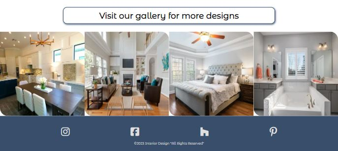

- Mobile view
  
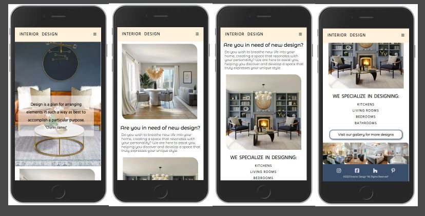

\
&nbsp;
[Back to Top](#table-of-contents)
\
&nbsp;

### About Page

On the About page, visitors will find information about the company.

The About page is organized into two sections. The first is the hero section, which follows the same design pattern as the home page. The second section provides details about the Interior Designs Company, accompanied by an image featuring the positive team.

- Desktop view
  
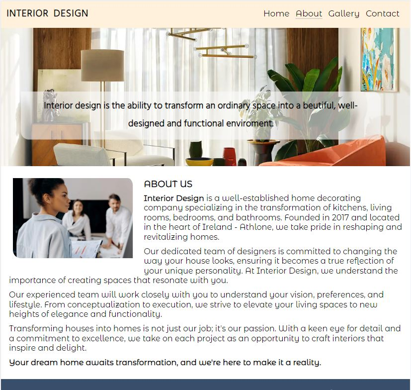

- Mobile view
  
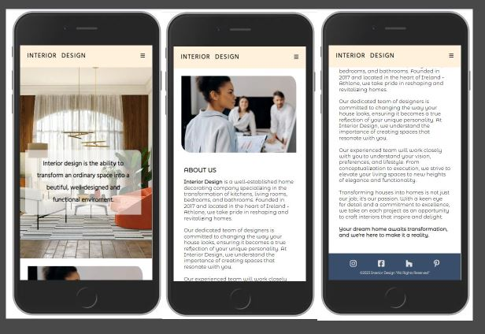

\
&nbsp;
[Back to Top](#table-of-contents)
\
&nbsp;

### Gallery Page

On the Gallery page, visitors will be presented with images that represent the work of Interior Designs.

The Gallery page is divided into two sections. The initial section follows the same pattern as the home page, featuring a hero image with text. The second section showcases 12 images of meticulously designed kitchens, living areas, bedrooms, and bathrooms. For screens larger than 992px, a hover effect has been added to enhance the user experience.

- Desktop view
  
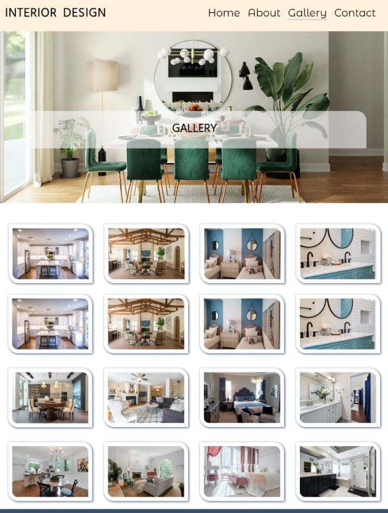

- Mobile view
  
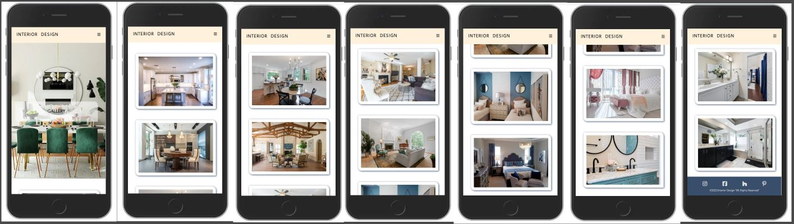

\
&nbsp;
[Back to Top](#table-of-contents)
\
&nbsp;

### Contact Page

The Contact page will present visitors with a free consultation form along with contact details.

For screens larger than 992px, a hover effect has been added to the submit button for a better user experience.

- Desktop view
  
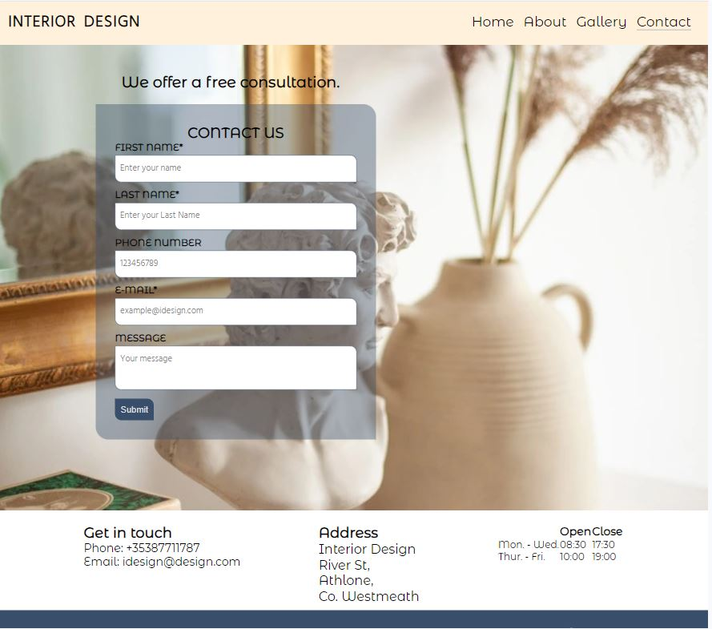

- Mobile view

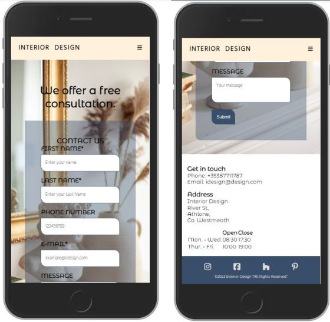

\
&nbsp;
[Back to Top](#table-of-contents)
\
&nbsp;

### Thank You Page

The purpose of the thank-you page/form submission is to confirm to the user that their form submission has been successfully received. The company will contact them within the next three working days.

- Desktop view

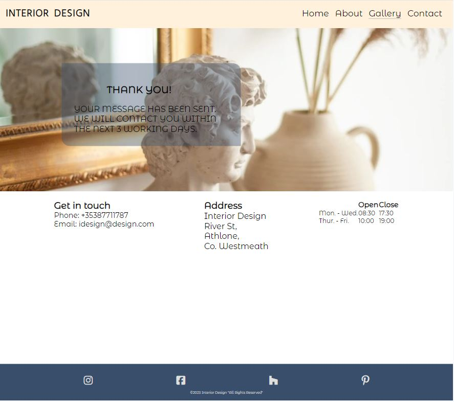

- Mobile view

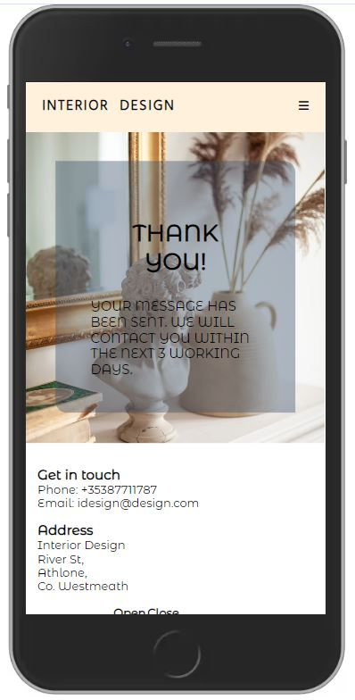

\
&nbsp;
[Back to Top](#table-of-contents)
\
&nbsp;

### 404 Page

A 404 page will be implemented and displayed if a user navigates to a broken link. A clickable link to the home page will be provided to ensure visitors can easily navigate back.

- Desktop view

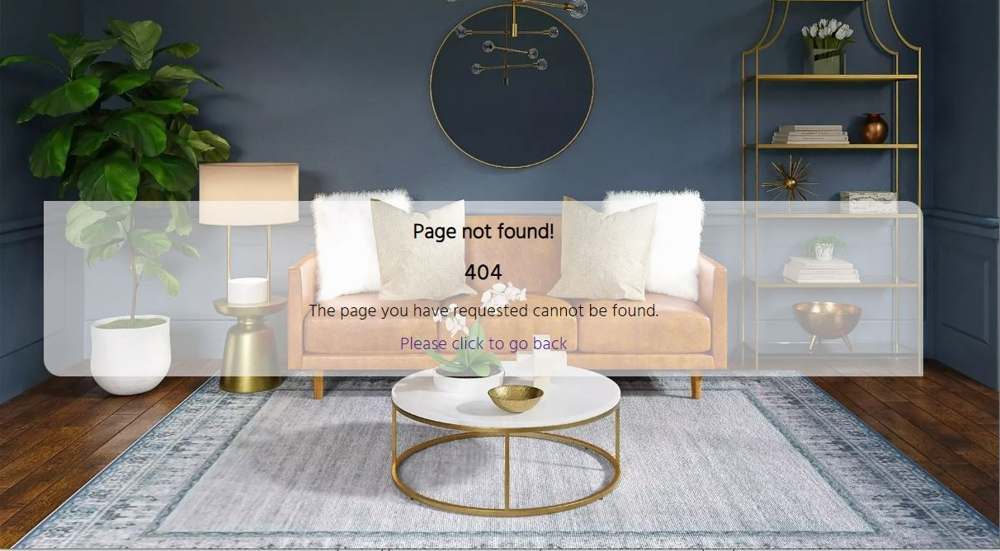

- Mobile view

\
&nbsp;
[Back to Top](#table-of-contents)
\
&nbsp;

### Features to be Implemented

- The third section of the Home Page presents images in the form of an infinite autoplay slider.
- Lightbox functionality will be added to the Gallery Page.

\
&nbsp;
[Back to Top](#table-of-contents)
\
&nbsp;

# Technology used

- **[HTML](https://www.youtube.com/watch?v=3OTSsq9Y0P4&t=5s)** - The structure of the Website was developed using HTML as the main language.
- **[CSS](https://www.youtube.com/watch?v=nV9oaUglBTE)** - The Website was styled using custom CSS in an external file.
- **[Javascript](https://www.youtube.com/watch?v=wm4F0Zqxu5A)** - Font Awesome Icons were implemented using JavaScript.
- **[VSCode](https://en.wikipedia.org/wiki/Visual_Studio_Code)** - The website was developed using Visual Studio Code IDE.
- **[GitHub](https://en.wikipedia.org/wiki/GitHub)** - Source code is hosted on GitHub and delpoyed using Git Pages.
- **[Git](https://en.wikipedia.org/wiki/Git)** - Used to commit and push code during the development opf the Website.
- **[Font Awesome](https://fontawesome.com/)** - Icons were used as the Social media links in the footer section.
- **[Google Fonts](https://fonts.google.com/)** - Google Fonts were used to style the text on the webpage.
- **[Canva](https://www.canva.com/)** - Icon from Canva was used as favicon.
- **[Favicon.io](https://favicon.io/favicon-converter/)** - Was used to convert and create favicon files.
- **[Figma](https://www.figma.com/)** - Was used to create both mobile and desktop wireframes.
- **[Pexels](https://www.pexels.com/)** - Images were sourced from Pexels.
- **[Image Color Picker](https://imagecolorpicker.com/)** - Was used to detect colours in images.
- **[Convertio](https://convertio.co/)** - Was used to conver images to webp format.
- **[Multi Device Website Mockup Generator](https://techsini.com/multi-mockup/index.php)** - Was used to check responsiveness on different devices.
- **[ChatGPT](https://en.wikipedia.org/wiki/ChatGPT)** - Was used to create content and check for grammar.

\
&nbsp;
[Back to Top](#table-of-contents)
\
&nbsp;

# Testing and Validation

- HTML validation using [W3C Markup Validation](https://validator.w3.org/) results:
  - [index.html](https://validator.w3.org/nu/?doc=https%3A%2F%2Fsanitab17.github.io%2Finterior-design%2Findex.html)
  - [about.html](https://validator.w3.org/nu/?doc=https%3A%2F%2Fsanitab17.github.io%2Finterior-design%2Fabout.html)
  - [gallery.html](https://validator.w3.org/nu/?doc=https%3A%2F%2Fsanitab17.github.io%2Finterior-design%2Fgallery.html)
  - [contact.html](https://validator.w3.org/nu/?doc=https%3A%2F%2Fsanitab17.github.io%2Finterior-design%2Fcontact.html)
  - [thank_you.html](https://validator.w3.org/nu/?doc=https%3A%2F%2Fsanitab17.github.io%2Finterior-design%2Fthank_you.html)
  - [404.html](https://validator.w3.org/nu/?doc=https%3A%2F%2Fsanitab17.github.io%2Finterior-design%2F404.html)

- CSS validation using [W3C Jigsaw Validator](https://jigsaw.w3.org/css-validator/) results:
  
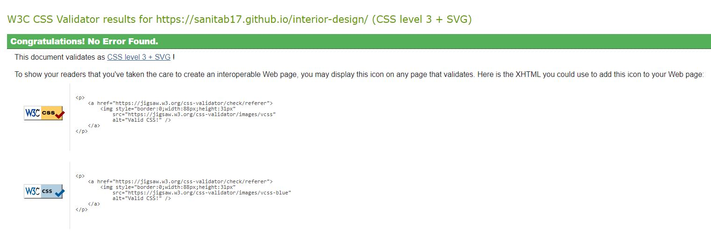
  
- Accessibility testing using [Wave](https://wave.webaim.org/) results:

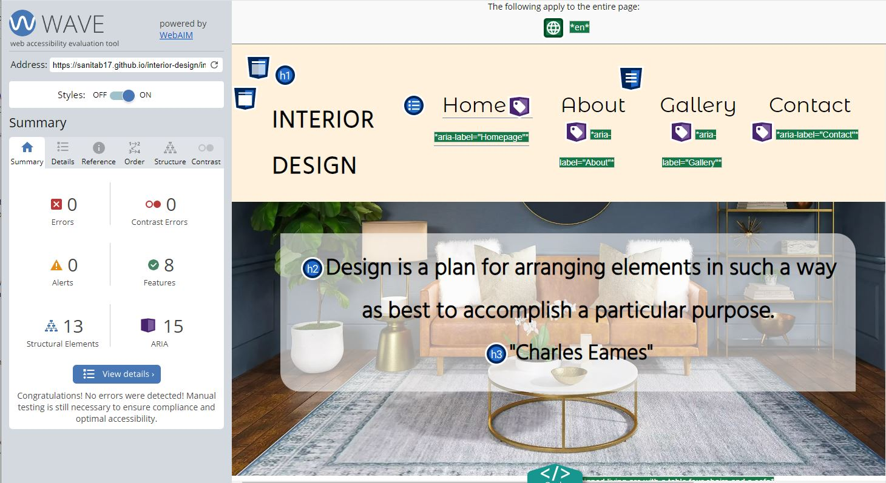

- Lighthouse test results:
  - Home Page
  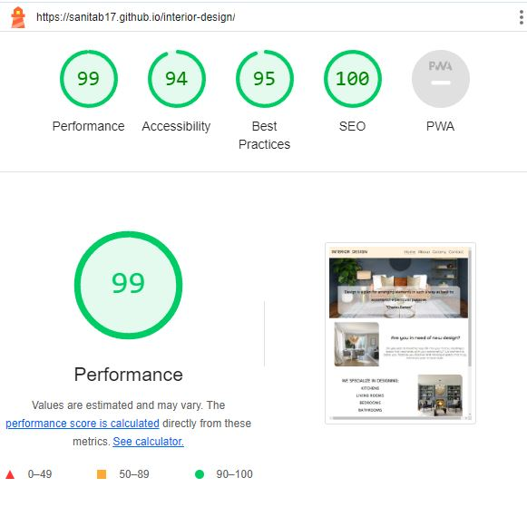

  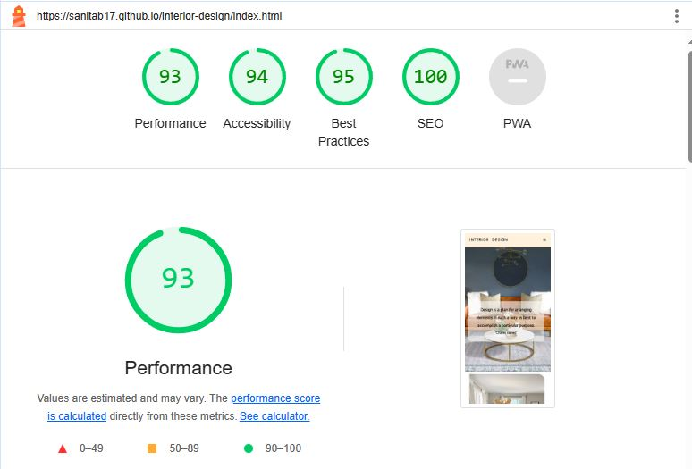

  - About Page
  
  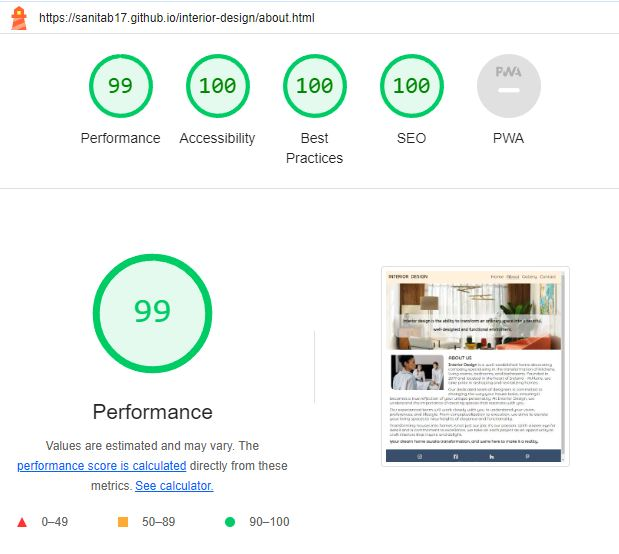

  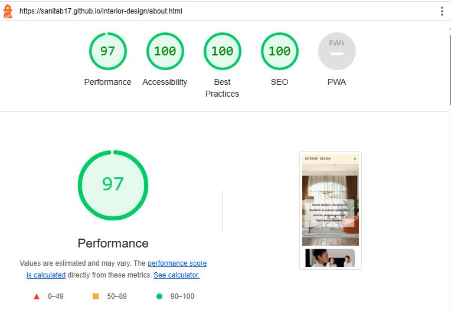

  - Gallery Page

  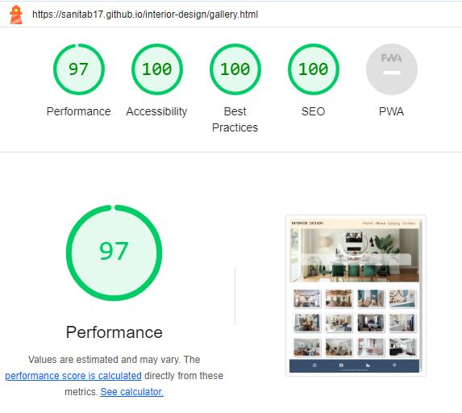

  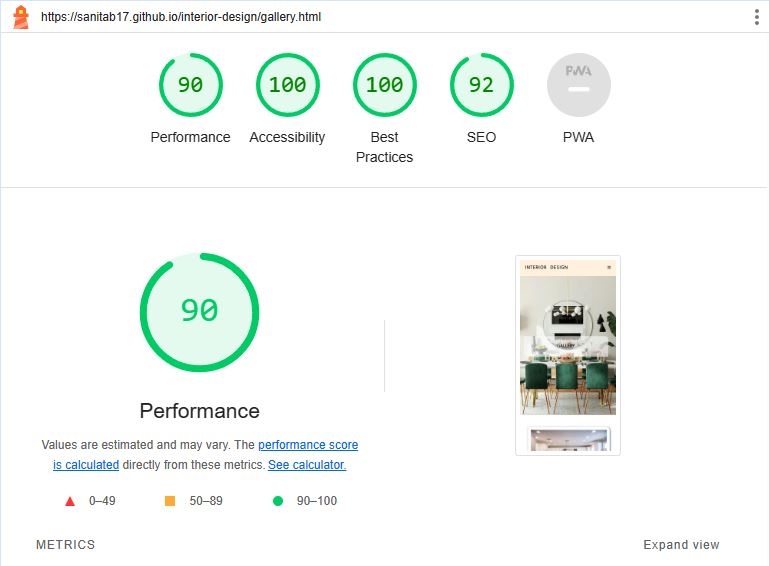

  - Contact Page

  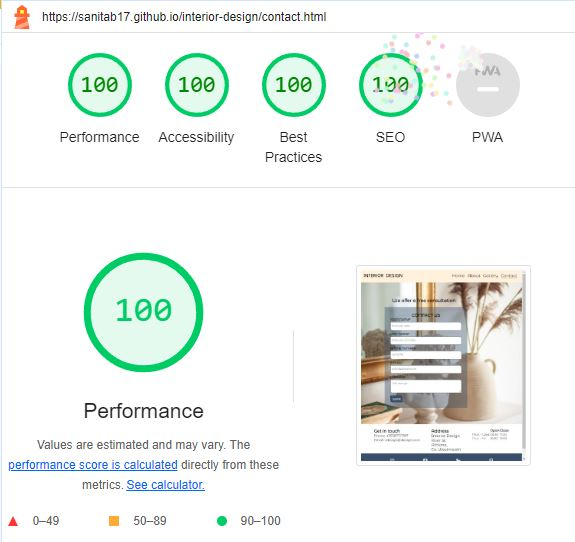

  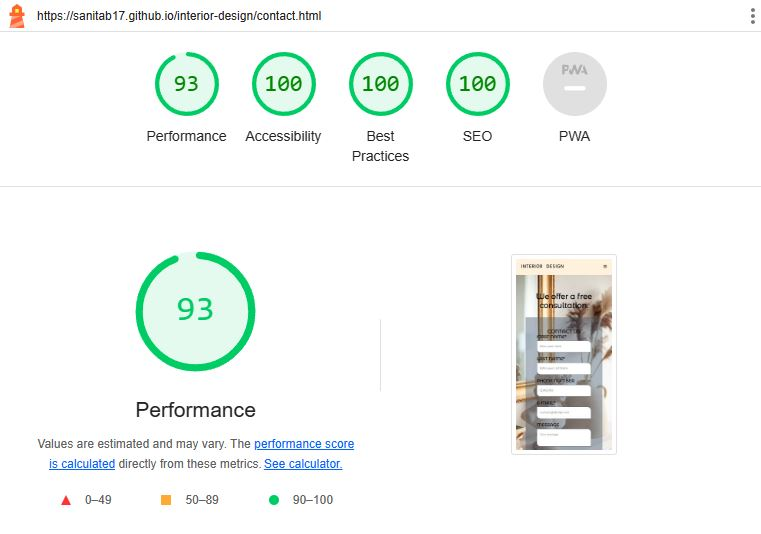

  - Thank You Page

  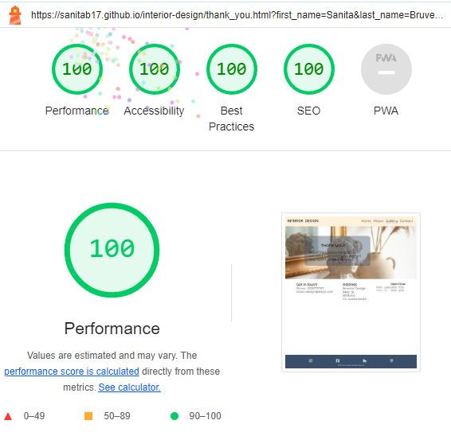

  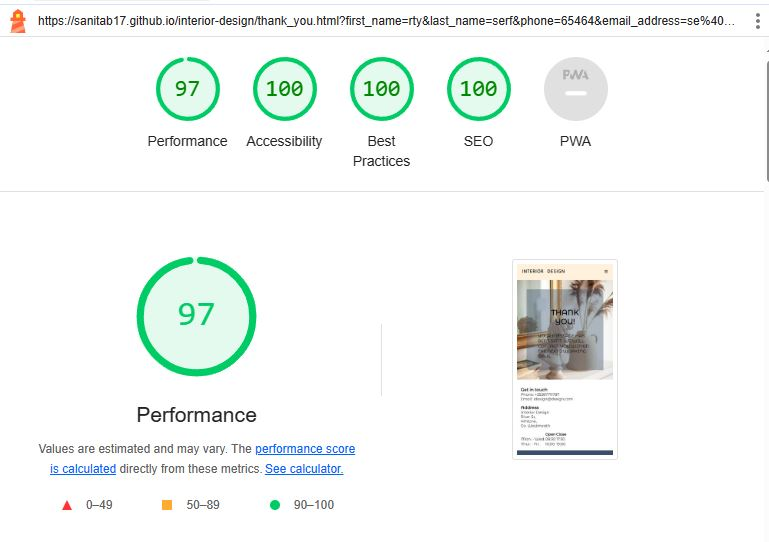

- Functional Testing:

|Test scenario|Steps|Observation| Pass |
|-------------|------------------|-----------|-------|
|Navigation links|Click on the menu links: home, about, gallery, contact.|Navigation links should lead to their respective pages.| Passed|
|Navigation active state| Click on the menu links: home, about, gallery contact.|When a menu link is clicked and the page opens, a blue underline should be visible, indicating that the page is active.| Passed|
|Mobile Menu Icon| Click on Icon| Menu should open and reveal website links.| Passed|
|Contact form submission| Fill in the form fields and subbmit the form| Form should be submitted, and the user should be redirected to thank you page.| Passed|
|Buttons|Click on the button|Buttons should lead to their respective pages.| Passed|
|Footer Social media links| Click on social links: instagram, facebook, houzz, pinterest.| Social links should lead to their respective pages and open in a new tab.| Passed|
|404 Page| Click on the "Please click to go back"| The user should be redirected to the homepage.| Passed|
|

- User Story Testing

|  User Story| Expected Result | Pass|
|-----------|-----------------|--------|
|As a user, I want to navigate the website using multiple devices and access social media.|The website should open seamlessly on various devices with different screen sizes and across multiple browsers, including Google Chrome, Microsoft Edge, Mozilla Firefox, and Safari. | Passed |
|As a user, I want to find general information about Interior Design.| General information about Interior Design is accessible on the About page.| Passed |
|As a user, I want to learn more about Interior Design's work.| Interior Design's work is easily accessible on the Gallery page.  | Passed |
|As a user, I want to be able to easily contact the website and see contact details|  Information is easily accessible on the Contact page. | Passed |
|As a user, I want to apply for free consultation.|  The form for a free consultation is easily accessible on the Contact page. | Passed |

\
&nbsp;
[Back to Top](#table-of-contents)
\
&nbsp;

## Bugs

There are no bugs to fix in the final project.

\
&nbsp;
[Back to Top](#table-of-contents)
\
&nbsp;

# Deployment

**Deployment to Github Pages**

- The site was deployed to GitHub pages. The steps to deploy are:

  1. Select the repository from the repository list.
  2. Go to the 'Settings' tab.
  3. In the sidebar menu, navigate to 'Pages.'
  4. Select 'Deploy from a branch' and choose the desired branch.
  5. Click 'Save.'
  6. The link to access the deployed page will be displayed at the top of the page.

You can access the deployed [Interior Design website here](https://sanitab17.github.io/interior-design/).

**Clone the Repository**

- Navigate to the GitHub Repository you want to clone to use locally:

  1. Click on the code drop down button
  2. Click on HTTPS
  3. Copy the repository link to the clipboard
  4. Open your IDE of choice
  5. Type git clone copied-git-url into the IDE terminal

The project will now be cloned on your local machine for use.

\
&nbsp;
[Back to Top](#table-of-contents)
\
&nbsp;

# Credits

For readme,

- [xttrust](https://github.com/xttrust/explore-romania?tab=readme-ov-file#features-to-be-implemented)

For header, hero section and footer,

- Love Running project

For the header hover underline effect and gallery hover effect,

- [CodingNepal](https://www.youtube.com/watch?v=AkK8yHC4TlI&t=358s)

For contact form,

- [W3Schools](https://www.w3schools.com/howto/howto_css_responsive_form.asp)

For contact details section,

- [Coffee House](https://learn.codeinstitute.net/sandbox/api/challenges/60338cca9c4983ac5d855130/files/index.html)

For 404 page,

- [Dee Mc](https://www.youtube.com/watch?v=Jj42_s3KnuM&t=238s)

For Images,

- [Pexels](https://www.pexels.com/)

For favicon,

- [Canva](https://www.canva.com/)

For checking grammar and content,

- [ChatGPT](https://en.wikipedia.org/wiki/ChatGPT)