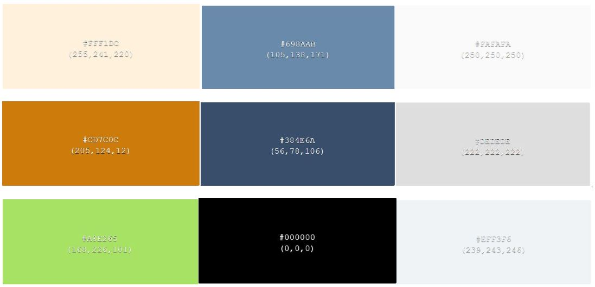
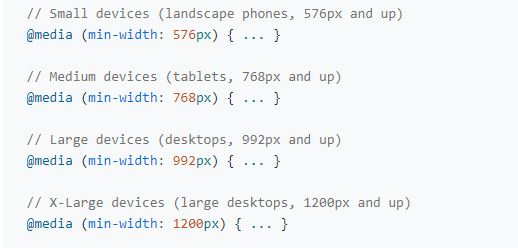

# INTERIOR DESIGN - CI Project 1

**Interior Design** is an imagined company in Athlone, Ireland. This website was created for educational purposes as part of the Code Institute Diploma in Full-Stack Software Development. The project is for individuals seeking to enhance and transform their homes and for anyone interested in interior design. 

[Live Preview Of Interior Design](https://sanitab17.github.io/interior-design/)

# Table of Contents

- [INTERIOR DESIGN - CI Project 1](#interior-design---ci-project-1)
- [Table of Contents](#table-of-contents)
- [UX](#ux)
  - [User](#user)
  - [User Goals](#user-goals)
  - [User Stories](#user-stories)
  - [Site owners Goals](#site-owners-goals)
    - [Requirements](#requirements)
    - [Expectations](#expectations)
  - [Design Choices](#design-choices)
    - [Fonts](#fonts)
    - [Icons](#icons)
    - [Colors](#colors)
    - [Structure](#structure)

# UX

## User

## User Goals

- Visually appealing.
- Effortless Exploration.
- Informative Content.

## User Stories

- As a user, I want to navigate the website using multiple devices and access social media.
- As a user, I want to find general information about Interior Design.
- As a user, I want to learn more about Interior Design's work.
- As a user, I want to be able to easily contact the website and see contact details.
- As a user, I want to apply for free consultation.

## Site owners Goals

- Attract more customers to Interior Design company.
- Inform customers about Interior Design's services.
- Inform customers about Interiors Design company.
- Show customers Interior Design's gallery as a portfolio.

### Requirements

- Easy to navigate on various screen sizes and search engines.
- Clear and precise information about Interior Design's company.
- Simple method of contacting the website.
- Visually appealing design maintained through all web pages.

### Expectations

- I expect all links to social media sites to be opened in a new tab.
- I expect all navigation links to work correctly.
- I expect screen size not to affect the quality of the website.
- I expect all information to be correct and accurate.

\
&nbsp;
[Back to Top](#table-of-contents)
\
&nbsp;

## Design Choices

### Fonts

In an effort to impart a sense of simplicity and a user-friendly aesthetic to the website, I have seamlessly integrated [Google Fonts](https://fonts.google.com/), [Hind Guntur](https://fonts.google.com/specimen/Hind+Guntur) and [Montserrat Alternate](https://fonts.google.com/?query=Montserrat+Alternates), with a sans-serif fallback. This approach is aimed at ensuring a user-friendly appearance.

### Icons
- I have opted to use open-source materials for icons, provided by [Font Awesome](https://fontawesome.com/icons).
- For the favicon, I used an icon from the [Canvas](https://www.canva.com/) and then converted it using [favicon.io](https://favicon.io/favicon-converter/).

### Colors 
As for colors I decided to match them with hero images using [Image Color Picker](https://imagecolorpicker.com/).

Use of various colors will explain below. 

- #fff1dc – Tis color will be used for header, to harmoniously match with hero images across the website.
- #698aab - This color will be used for active navigation bar underline, to provide clear user guidance throughout the website.
- rgb(250, 250, 250, 0.6) (transparency of #fafafa) - This color will be used for hero texts background.
- #384e6a - This color will be used for borders, shadows, color for submit button and background color as hover effect and footer background.
- rgb(56, 78, 106, 0.4) (transparency of #384e6a) - This color will be used for contact form background and thank you page text background, to maintain visually appealing look.
- #dedede - This color will be used for home page button hover effect, submit button color and as hover effect buttons background. Additionally, it will be used for the icons and text in the footer, ensuring harmonious design.
- #a8e265 - This color will be used for navigation bar as background color before transition, complementing the green plants in hero images for a visually pleasing experience.
- #cd7c0c - This color will be used for navigation bar as background color after transition.
- #000000 - Thie color will be used for text.
- #eff3f6 - This color will be used as the theme color, contributing to a light and neutral color palette throughout the website.

### Structure

My website development will follow to a mobile-first strategy, as instructed in the Love Running Project, with a focus on smaller screens initially. I will commence styling for the Samsung Galaxy Fold, which has a width of 280px. To ensure responsiveness, I will rely on common standard media query breakpoints for responsive web design.

